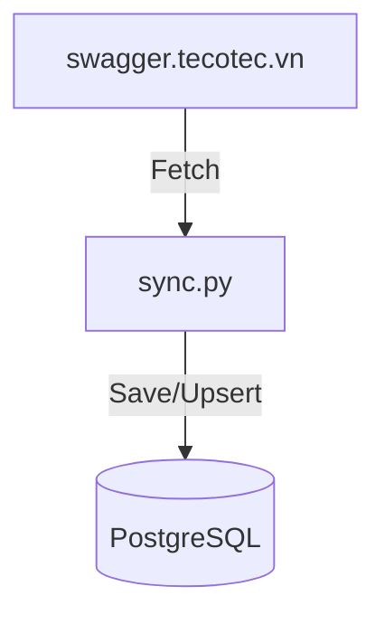
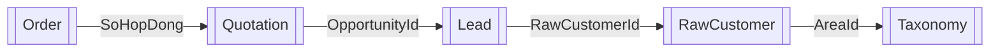
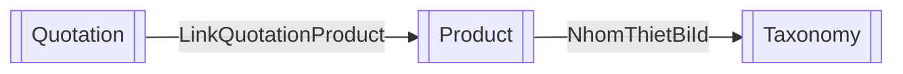

# Luồng Dữ Liệu & API đồng bộ

Sơ đồ thể hiện cách thức dữ liệu dịch chuyển từ hệ thống API live và cách xử lý phân tích trong cơ sở dữ liệu local.

---

## 1. Đồng bộ dữ liệu (Sync)
Được kích hoạt thông qua Sync Console của dashboard hoặc gọi API `/api/sync/start`.

* Quy trình đồng bộ [[Product]] và [[Taxonomy]] (Thương hiệu, Danh mục thiết bị).
* Quy trình đồng bộ [[Customer]] và [[Taxonomy]] (Tỉnh thành/Khu vực).
* Quy trình đồng bộ [[Order]] liên kết với [[Quotation]].
* Quy trình đồng bộ [[Lead]] (Nếu API live lỗi, kích hoạt generator tạo mock data tự động).

---

## 2. Chuỗi kết hợp dữ liệu báo cáo (Join Chains)

### Doanh thu Đơn hàng theo Tỉnh/Thành phố

### Báo giá thắng/thua & Doanh thu theo nhóm sản phẩm

---
➔ Quay lại: [[00_Start_Here]]
